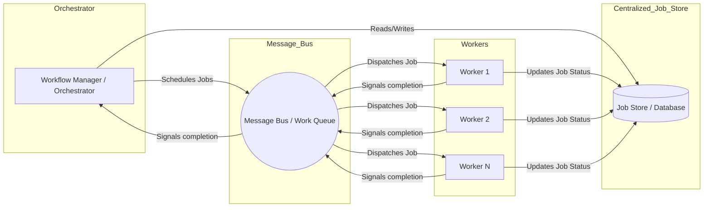

# Workflow POC Application

This is a proof-of-concept (POC) application for a smart community workflow system. It demonstrates a distributed architecture using Spring Boot microservices, RabbitMQ for messaging, and Docker Compose for container orchestration.

## Overview

The application consists of two main Java Spring Boot services that communicate asynchronously via RabbitMQ:

- **Workflow Manager**: Handles workflow creation, task management, and API endpoints for interacting with workflows.
- **Worker**: Processes tasks from a persistent RabbitMQ queue.

And a mock web UI for interacting with the manager:

- **WM Console**: React admin console for workflow CRUD via REST API


## Features

The application mocks the management and execution of a *workflow* composed of multiple *jobs* over a distributed system, where the orchestrator (manager) defines and dispatches the jobs while workers independently manage their workloads.

A centralized job *store* serves as repository for jobs: both manager and workers can read and write to keep track of the executions. Concurrency and data consistency is handled by *versioning*: at every write the version counter is incremented, assuring that stale copies can not overwrite fresh ones.

## Architecture
The following diagram shows the centralized job store, the orchestrator (manager), multiple workers, and the message bus used for the work queue.

The orchestrator dispatches jobs to the message bus, which delivers work to workers. All components interact with the centralized job store for job status and data.





### Services

The application is composed of the following services in Docker Compose:

- **RabbitMQ**: Message broker service using the official `rabbitmq:3-management` image. Provides AMQP messaging and a management UI.
  - Ports: 5672 (AMQP), 15672 (Management UI)
  - Default credentials: guest/guest
  - Persistent data volume: `rabbitmq_data`

- **Workflow-Manager**: Spring Boot application for workflow management.
  - Built with Java 21 LTS
  - Exposes REST API on port 8080
  - Includes OpenAPI/Swagger documentation
  - Depends on RabbitMQ service

- **Worker**: Spring Boot application for task processing.
  - Built with Java 21 LTS
  - Consumes tasks from RabbitMQ queue
  - Processes and completes tasks asynchronously

- **WM-Console**: React admin web console
  - Exposes http port 5173
  - Connects to workflow-manager on http://localhost:8080 (configurable)

### Java Projects

#### Workflow-Manager (`workflow-manager/`)
- **Main Class**: `WorkflowPocApplication.java`
- **Key Components**:
  - `WorkflowController`: REST API endpoints
  - `WorkflowService`: Business logic for workflows
  - `TaskStoreService`: Task persistence
  - `MessagingService`: RabbitMQ integration
  - `TaskCompleteProcessor`: Task completion handling
- **Dependencies**: Spring Boot Web, AMQP, Data JPA, SpringDoc OpenAPI

#### Worker (`worker/`)
- **Main Class**: `WorkerPocApplication.java`
- **Key Components**:
  - `WorkerService`: Task processing logic
  - `TaskStoreService`: Task persistence
- **Dependencies**: Spring Boot AMQP, Data JPA

## Prerequisites

- Docker
- Docker Compose (or Podman Compose)

## Building and Running

### Build the Application

1. Clone or navigate to the project directory:
   ```bash
   cd /path/to/workflow-poc
   ```

2. Build the Docker images:
   ```bash
   docker-compose build
   ```
   or
   ```bash
   podman compose build
   ```

   This will:
   - Build the Maven projects inside Docker containers
   - Create JAR files for both services
   - Package them into runtime images

### Run the Application

1. Start all services:
   ```bash
   docker-compose up
   ```
   or
   ```bash
   podman compose up
   ```

2. The services will start in the following order:
   - RabbitMQ (with health check)
   - Workflow-Manager (after RabbitMQ is healthy)
   - Worker (after RabbitMQ is healthy)
   - WM Console (after Workflow-manager is started)


3. Test the execution submitting a simple workflow (e.g., using curl or via OpenAPI Explorer): 
```
curl -X POST http://localhost:8080/api/workflow -H "Content-Type: application/json" -d '{ "name": "wf", "id": "1","tasks": [{ "type": "t1" }, { "type": "t2" }]}'
```

4. Access the web UI at http://localhost:5173 and create a workflow via web form. By accessing the details page one can monitor the jobs progress and verify the status

### Access the Application

- **WM Console**: http://localhost:5173
- **Workflow Manager API**: http://localhost:8080
- **Swagger/OpenAPI Documentation**: http://localhost:8080/swagger-ui/index.html
- **RabbitMQ Management UI**: http://localhost:15672 (username: guest, password: guest)

### Stopping the Application

```bash
docker-compose down
```
or
```bash
podman compose down
```

To remove volumes (including RabbitMQ data):
```bash
docker-compose down -v
```

## Configuration

The application uses environment variables for configuration (defined in `application.yml`):

- `SERVER_PORT`: Application port (default: 8080)
- `RABBITMQ_HOST`: RabbitMQ host (default: localhost, set to `rabbitmq` in Docker)
- `RABBITMQ_PORT`: RabbitMQ port (default: 5672)
- `RABBITMQ_USERNAME`: RabbitMQ username (default: guest)
- `RABBITMQ_PASSWORD`: RabbitMQ password (default: guest)

## Development

### Local Development

To run services locally (outside Docker):

1. Ensure Java 21 and Maven are installed
2. Start RabbitMQ locally or via Docker
3. Build and run each service:
   ```bash
   cd workflow-manager
   mvn clean package
   java -jar target/*.jar

   cd ../worker
   mvn clean package
   java -jar target/*.jar
   ```

4. Install dependencies and run the web application
   ```bash
   yarn install
   yarn dev
   ```


### Testing

Run tests for each service:
```bash
cd workflow-manager
mvn test

cd ../worker
mvn test
```

## Technologies Used

- **Java 21 LTS**: Runtime environment
- **Spring Boot**: Framework for microservices
- **RabbitMQ**: Message broker
- **Maven**: Build tool
- **Docker & Docker Compose**: Containerization and orchestration
- **SpringDoc OpenAPI**: API documentation
- **React Admin**: react web admin development framework

